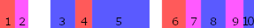

### Notation

We describe the grammars using a variant of BNF notation, extended with "?" to denote an optional construction (e.g. `A?` is equivalent to `(A | )`, "*" to denote zero or more occurrences (`A*` is `(A A* | )`) and `+` to denote one or more occurrences (`A+` is `A (A+ | )`).

Literal text is delimited by quotes `" ... "` and lowercase words denote non-terminals (`main`, `rule`, etc). Symbols are implicitly separated by whitespaces.

# Calc: a minimal example

Here is a small error specification to add error messages to Menhir's Calc demo:

```ocaml
{
  let print_loc (pos : Lexing.position) =
    Printf.sprintf "line %d, column %d"
     pos.pos_lnum (pos.pos_cnum - pos.pos_bol)
}

rule error_message = parse error (main)
| /expr: . INT { "Syntax error: expecting an integer" }
| lpos=LPAREN; [expr / ... . RPAREN]
  { "Syntax error: expecting a closing parenthesis (opened at " ^ print_loc $startloc(lpos) ^ ")" }
```

The full example can be found in [examples/calc](https://github.com/let-def/lrgrep/tree/parser-tweak/examples/calc) directory, with the specification living in [parse_errors.mlyl](https://github.com/let-def/lrgrep/blob/parser-tweak/examples/calc/parse_errors.mlyl) and the grammar in [parser.mly](https://github.com/let-def/lrgrep/blob/parser-tweak/examples/calc/parser.mly). The first part of the file, delimited by the `{`/`}` pair, is called the "header" and contains arbitrary OCaml definitions that can be referred to later. The header is optional, and followed by a list of rules. This file defines a single rule called `error_message`.

*Clauses.* The rule has two clauses. A clause is made of a pattern and an action. The first pattern is ` /expr: . INT` and the action is `"Syntax error: expecting an integer"`. The pattern matches when we are ready to recognize an integer. In LR parlance, it is when the item `expr: . INT` is active. `expr: INT` is a rule of the grammar (see [parser.mly line 20](https://github.com/let-def/lrgrep/blob/parser-tweak/examples/calc/parser.mly#L20)), and the `.` identifies a specific position in this rule. `/` is the "filtering" operator that restricts matches according to active items. 
The second pattern is slightly more involved. It is meant to identify situations in which a closing parenthesis is expected. The relevant grammatical rule is `expr: LPAREN expr RPAREN`, so why not simply using `/expr : LPAREN expr . RPAREN`, like in the first pattern? The problem has to do with _reductions_. When reaching a situation where a closing parenthesis is expected, the parser is not directly in a state where the item `expr : LPAREN expr . RPAREN` is valid, because it has not reduced the `expr`. For instance with input `(1 + 2`, just before failing the parser's stack is `LPAREN expr PLUS INT`, which doesn't match our pattern. To give more control to the author of error messages, LRgrep provides the `[ ... ]` "reduction" operator to let one decides whether to reduce or not before matching a sub-pattern. Since we want to match after reducing, the right pattern is `[expr / expr: LPAREN expr . RPAREN]`: reduce to an `expr`, and then filter to those where `expr: LPAREN expr . RPAREN` is active. `[expr / ... . RPAREN]` is just a shorthand to avoid repetition: `...` acts as a "glob", expanding to any sequence of symbol that would result in a valid item. Finally, we prefix the pattern with `lpos=LPAREN;`. `LPAREN` restricts the match to situations where an opening parenthesis precedes the expression. `lpos=` is a capture, which allows us to refer to the position of this parenthesis in the message using `$startloc(lpos)`.

*Preferring precise patterns.* In both cases, we can observe that the pattern and the message mirror each other: a good pattern should, as much as possible, translate in formal terms the content of the message. For instance, using `LPAREN; [expr]` for the second pattern would have the same effect, even though the closing parenthesis is not mentioned. In the grammar, an `RPAREN` always appear after `LPAREN expr`: it is implied anyway. However this is not future proof. If the grammar is later extended with an hypothetical rule like `definition: LPAREN expr COLON type RPAREN`, the clause would still apply, silently leading to an incorrect error message. In this case, only a `COLON` allow to continue the analysis! Therefore, it is a good practice for the pattern to be at least as restrictive as the error message.

*Scope of a rule*. The text `parse error (main)` indicates that the rule is meant to handle errors that occurred when parsing from the `main` entrypoint of Calc's grammar. `error` is optional; if it is omitted the generator will be applicable to any parsing configuration, not just the erroring ones. The entrypoint specification admits other variants as well: `(main)` specifies a single entrypoint, a comma-separated list denotes `(main, aux, ...)` multiple entrypoints, and completely omitting it is equivalent to listing all entrypoints. Therefore using `parse`, `parse (main)` or `parse error` would also be valid. But `parse error (main)` is more precise: it allows the code generator to output a smaller program and the coverage analysis to give a more relevant information. 

*Textual precedence.* If a situation matches mutiple clauses, the first clause, in text order, has priority. (In this example, the two clauses are mutually exclusive, but it is not the case in general.)

*Coverage check.* To guarantee that all error cases are covered we can run a coverage analysis: `lrgrep -coverage parser.cmly parse_errors.mlyl`. The coverage analysis outputs a list of uncovered sentences. In this case, it should output an empty list. For this simple grammar, only two rules are sufficient for covering all cases with reasonable explanations. (An unreasonable clause would be `| { "Syntax error" }`: it provides full coverage and a useless message.)

TODO: The coverage check erroneously reports "rule error_message: coverage is not exhaustive" but provides no counter example. This is because accepting states are not handled correctly at the moment: `expr EOL` is first found to not be covered, and later found to be unreachable.

# Syntax

An `.mlyl` file is made of a sequence of rules, as well as optional heading and trailing block of OCaml code, wrapped between `{` ... `}`.

```
mlyl: 
  header
  rule* 
  trailer

header: action?
trailer: action?

action: "{" OCaml code ... "}"
```

The heading and trailing codes, if present, should be syntactically valid OCaml structures.

**Rules.** A rule starts with the keyword "rule", followed by a list of identifiers: the name of the rule, mandatory, followed by zero or more parameters. Identifiers follow OCaml lexical conventions. The rule might apply to any parser (`= parse`), or to only parse errors (`= parse error`), and can be restricted to only certain entrypoints by specifying them between parentheses. After that comes the list of clauses.

```
rule: "rule" ident ident* "=" "parse" "error"? entrypoints? clause*

entrypoints: "(" symbol ( "," symbol )* ")"

ident: ["a"-"z" "A"-"Z" "_"]  ["a"-"z" "A"-"Z" "0"-"9" "_" "'"]

symbol: ident | ident "(" (symbol ("," symbol)* )? ")"
```

Grammatical symbols follow Menhir's conventions:

- A terminal starts with an upper-case, like `INT`.
- A (ground) non-terminal starts with a lower-case, like `expr`.
- An instance of an higher-order non-terminal uses function application notation. They start with a non-terminal ident followed by a comma-separated list of symbols between parentheses. E.g. `list(INT)`. 

**Clauses**. A clause starts with a "|" followed by a pattern and an optional lookahead constraint, restricting the situations in which it applies, and ends with an action. Three kind of actions are possible:

- *total action:* common case is a piece of OCaml code wrapped between "{"/"}" and that is executed when the clause matches. Matching ends, returning the value the OCaml code evaluated to.
- *partial action:* sometimes, semantic information are needed to decide whether a clause applies or not. To handle this case, LRgrep provides the `%partial` keyword. If an action is preceded by `%partial`, the OCaml code should evaluate to an `option` value: if it is `None`, matching continues with next clauses. If it is `Some ` value, matching ends, as in the total case.
- *unreachable action:* to ensure that a case is never reached, it is possible to use an unreachable action noted `{ . }`. In this case, LRGrep will check that no input can match this clause, because all cases covered by the pattern were already covered by clauses with higher priority.

TODO: unreachable action are not implemented yet.

```
clause: "|" pattern lookahead? ( "|" pattern lookahead? )*
        clause_action

clause_action: "%partial" action | "{" "." "}"
```

**Patterns.** The pattern language is a dialect of regular expressions. Therefore we can find the usual regular operators: sequence, disjunction, repetition (Kleene-star), atom (matching a single symbol) and the empty match, or $\epsilon$.

The LRgrep specific operators are filters and reductions. A filter restricts current matches to the ones in which a designated item is active, without consuming any input. A reduction operator recognizes situations that would match after a sequence of zero or more reductions. Furthermore, LRgrep supports captures for the base case of matching a symbol and the reduction can be bound to a name.

The Kleene-star and the reduction operators also have longest variant to disambiguate captures. When there are multiple ways of matching the same input, the different matches can lead to different values being captured. `[...]` and `*` favor the shortest matches while `[[...]]` and `**` favor the longest ones.

```
(* Base patterns *)
pattern:
  | "/" filter                -- item filtering
  | (ident "=")? capturable   -- optionnally extracting a value

filter: ( symbol ":" )?  ( "." | "..." | symbol )*

(* Patterns from which one can extract a value *)
capturable:
  | symbol                    -- one symbol
  | "_"                       -- any symbol
  | "[" pattern "]"           -- reduction pattern

(* Composition patterns *)
pattern:
  |                           -- empty pattern, always matching
  | pattern "*"               -- pattern repetition (Kleene star)
  | pattern "?"               -- optional pattern
  | pattern ";" pattern       -- pattern sequence
  | pattern "|" pattern       -- pattern disjunction
  | "(" pattern ")"           -- parentheses for disambiguation

(* Longest variants *)
capturable: "[[" pattern "]]" -- longest reduction
pattern: pattern "**"         -- longest repetition
```

**Lookahead constraints.** A clause can be restricted to match only for certain lookahead tokens. By adding "@" followed by a comma-separated list of symbols after the pattern of a clause, the pattern will match only when the lookahead token that caused a parser to fail belongs to the list. The list specifies the list of terminals allowed as lookahead. Elements of the list are either a terminal or the special syntax `first(nt)`, where `nt` is a nonterminal, which expands to the list of terminals in $\text{FIRST}(nt)$, the terminals that can appear as the first element of sentences generated by $nt$: $\{ a \in T | \exists u, a.u \in L(nt) \}$. In the _calc_ example, `first(expr) = INT, LPAREN`.

```
lookahead: "@" (lookahead_symbol ("," lookahead_symbol)* )?

lookahead_symbol: terminal | "first" "(" nonterminal ")"
```

# Implementation: overview

LRGrep is implemented as a pipeline similar to that of a traditional compiler. Actually, it is a compiler: LRgrep consumes an LR automaton and an "error specification", a program expressed in a custom language, and from these it produces OCaml code that realizes the program. The entrypoint is implemented in the [Main](https://github.com/let-def/lrgrep/blob/parser-tweak/src/main.ml) module.

## LR(1) preprocessing

At a high-level, LRgrep starts by (pre?) processing the automaton to extract relevant information, without even looking at the error specification. We can identify these pre-processing steps:

- [Info](https://github.com/let-def/lrgrep/blob/master/src/mid/info.ml): extract high-level information from the grammar and the automaton; the main purpose is to present these pieces of information in forms suitable to ease further processing 

- [Viable_reductions](https://github.com/let-def/lrgrep/blob/master/src/mid/viable_reductions.ml): a graph that helps relating a stack suffix to the sequence of reductions applicable to it. Given a stack representing a sentential form $\beta$, it can be used to compute all the $\alpha$ such that $\alpha \xRightarrow{rm} \beta$ by looking at the shortest suffix of the stack for which the relation holds.

- [Reachability](https://github.com/let-def/lrgrep/blob/master/src/mid/reachability.ml): applies our [fast reachability analysis](https://dl.acm.org/doi/10.1145/3486608.3486903) algorithm
- [Lrc](https://github.com/let-def/lrgrep/blob/master/src/mid/reachability.ml): a refinement of the LR(1) graph which contain only reachable paths (transitions that were unreachable because of lookahead constraints are removed). This is the case when the LR(1) automaton was constructed with conflict resolution.
- [Reachable_reductions](https://github.com/let-def/lrgrep/blob/parser-tweak/src/mid/reachable_reductions.ml): a refinement of the viable reduction transducer, using the Lrc graph, which contain only the reachable sequences of reductions. The "viable reduction" transducer enumerate only viable reductions (those that preserve the viability of the prefix on the stack), but some might also be unreachable, for the same reason that some LR(1) transitions might be unreachable. Thus it induces a finer relation $\mathcal R_R \subset \mathcal R$ that only relates reachable suffixes. Furthermore, the reachable reduction graph also track "failing configurations", inducing a second relation $\mathcal R_F$ such that $\alpha \mathcal R_F a$ when lookahead $a$ is guaranteed to cause a parser with suffix $\alpha$ to fail. Conversely, if a parser with a stack $\gamma$ fails looking ahead at $a$, then $\exists \alpha, \beta$ such that $\gamma = \beta . \alpha$ and $\alpha \mathcal R_F a$.

*Info* and *Viable_reductions* are always computed and are required by the rest of the pipeline.

*Reachability* and *Lrc* are used to generate a more optimized matcher, by pruning unreachable stacks; this optimization is always enabled in LRgrep, but could be made optional.

*Reachable_reductions* is used only by static analyses and not by the normal compilation pipeline. It is part of the enumeration feature (listing sentences to cover all failing configurations of a grammar) and of the coverage feature (finding failing configurations that don't have an error message associated to them).

Intuitively, it is fine for normal compilation to use an over-approximation of the parser's possible configurations: that matcher will accept more inputs than what is really possible. This is the case when using the LR(1) DFA and *Viable_reductions* to enumerate configurations. However static analyses should be exact (an over-approximation could report false positives: uncovered cases which are impossible in practice, an under-approximation could report false negatives: not reporting uncovered cases which are possible in practice). *Lrc* and *Reachable_reductions* do that.

## Source processing

It is now possible to work on the error specification itself. The main steps are:

- [Transl](https://github.com/let-def/lrgrep/blob/master/src/mid/transl.ml): translate grammatical constructs from surface syntax into LR(1) states; a symbol translates to the set of LR(1) states that have this incoming symbol, an item filter translates into a filter accepting all states that have this item in the (closure) of their item set, etc. It's also where the order of the regular expression is reversed: in the surface syntax, expressions are written from left to right, but matching happens right-to-left (starting from the top of the stack); to keep the usual "left-to-right" notation for regular expression and automata, the source expression is reversed now (i.e. all sequences "a;b" are flipped to "b;a") 
- (TODO: a wildcard translates to the set of all LR(1) states, a reduction translates to ...)

- [Regexp](https://github.com/let-def/lrgrep/blob/parser-tweak/src/mid/regexp.ml): derivation for (translated) regular expressions and reduction operators 

- [Automata](https://github.com/let-def/lrgrep/blob/parser-tweak/src/mid/automata.ml): produce NFAs from regular expressions, determinize the reachable subset of NFAs, perform register allocation, dead-code elimination and minimization of the DFA, then generate code (TODO: split)

## Support libraries

The [support/](https://github.com/let-def/lrgrep/tree/parser-tweak/support) folder is the bridge between the compilation and execution of LRGrep matchers:

- [Lrgrep_runtime](https://github.com/let-def/lrgrep/blob/parser-tweak/support/lrgrep_runtime.mli) defines the bytecode language used by LRgrep program and interpreters for sparse tables and bytecode programs
- [Lrgrep_support](https://github.com/let-def/lrgrep/blob/parser-tweak/support/lrgrep_support.mli) implements a bytecode emitter and sparse table generator, to turn an automaton into a compact program suitable for the runtime interpreters

# Implementation : utilities

A few libraries are used throughout the codebase. The most important is the finite set / indexing infrastructure. 

## Manipulating finite sets

LRgrep has to manipulate a lot of finite sets (the sets of terminals, non-terminals, symbols, productions of the grammar; the sets of LR(0) and LR(1) states, of transitions and reductions of the LR automaton; etc).

A generic library for constructing and safely manipulating finite sets and their elements is implemented in `Fix.Indexing`. The trick is to use a phantom type to represent a finite set. The two base types are `'n cardinal` and `'n index`:

- `n cardinal` carries the cardinal of set `'n`. It can be turned to an integer using `val cardinal : 'n cardinal -> int`.
- `'n index` is an element of the set `'n`. By construction, if `n : 'n cardinal` and `i : 'n index` then `0 <= Index.to_int i < cardinal n`.

Therefore, `'n cardinal` denotes the finite set with $n$ elements and `'n index` denotes an element of this set represented by an integer in $[0;n[$.

### Introducing sets and elements

In practice, `type +'n index = private int`. An index is really just a fancy integer, the library enforces that only values less than the cardinal can be introduced. The main way is to use `Index.of_int : 'n cardinal -> int -> 'n index`, which checks that the integer argument lies in the right range before casting it as an index.  Also note that the parameter is covariant: phantom witnesses are constructed such that if  `n` is a subtype of `m`, `cardinal n <= cardinal m`.

The main trick lies in the construction of the phantom witnesses, `type n` and `type m`. Usually, a finite set is represented as a pair `type n val n : n cardinal`. The abstract type is there just to introduce a name, and the value defines the actual size of the set, necessary at runtime. Existentials are a bit annoying to introduce in OCaml: at the module level, we use functors to create new types; at the value-level, we use first-class modules/packages or GADTs.

The `Const` module introduces a set of a fixed size:

```ocaml
module One = Const(struct let cardinal = 1 end) : sig
  type n
  val n : n cardinal
end
```

A cardinal is almost an integer, and with functionalities we have introduced so far, `type !'n cardinal = private int` would be a valid implementation. However, sometimes we construct a set before knowing the exact number of elements. As long the cardinal as not been observed, it is safe to "extend" the set, creating new elements.

For this use-case, there is also a `Gensym() : sig type n val n : n cardinal val fresh : unit -> n index end` functor. `fresh ()` return a new element (larger than all elements introduced before), growing the set, as long as `cardinal n` has not been called. After that, it is invalid to call `fresh ()` and it raises an exception.

### Vectors: finite functions

The first type that benefits from finite set is `type ('n, 'a) vector`. It is an `'a array` whose domain is the elements of finite set `n`. `Fix.Indexing.Vector` exposes most of `Array`  functions on vectors.

By construction, we know that an index is within bounds, so a minor benefits is that we can skip bound-checking. But the main benefits is that the finer typing allows manipulating many arrays, ranging over different domains, while being protected from making mistakes.

Compare:

```ocaml
val symbols : int
val symbol_names : string array
val incoming_symbol : int array
```

and:

```ocaml
type symbol
type state
val symbols : symbol cardinal
val symbol_names : (symbol, string) vector
val incoming_symbol : (state, symbol) vector
```

Vectors are often used to represent finite functions. Since they are mutables, they are convenient to generate functions by computing fixpoints.

The `Vector.length : ('n, _) vector -> 'n cardinal` function is convenient to recover a cardinal from a vector, avoiding to carry around an extra value. 

**Boolvector.** To reduce memory consumption, a specialised implementation is provided for the boolean case, represented as a compact bitstring. It has less features but can be used when memory use matters.

### IndexSet: finite subsets

An `'n IndexSet.t` is a subset of $[0;n[$. Elements of this subsets are `'n index`. It is represented as a linked list of word-sized bitmaps, and therefore is very compact for representing locally-dense subsets. This simple implementation proved to be performant enough sofar.

Since the type is polymorphic with respect to the finite set, we don't need to instantiate a functor for each case. In all subjectivity, this is a huge relief when manipulating many sets over different domains in the same function. 

TODO: it might be worth evaluating a balanced representation, for instance using a Patricia Trie, keeping the compact representation of leaves.

### IndexMap: (balanced) map on finite subsets

An `('n, 'a) IndexMap.t` is just a `Stdlib.Map` on finite sets. Again, the benefits is not having to instantiate (and pass around) a module for each finite set.

TODO: It might be worth evaluating a specialized representation, such as Okazaki's "*Fast Mergeable Integer Maps*". Not a bottleneck for the moment (but worth keeping an eye on, especially when used to represent *Monotonous Functions*, see *Coverage analysis*)

## Partition refinement

LRgrep needs to compute a few partitions: 

- in the reachability analysis, for each state, we partition lookaheads into classes having the same behavior with respect to reductions
- when constructing the DFA, we partition the outgoing transitions of NFAs according by their label.

The sets involved can be quite big. OCaml parser has around ~200 tokens and ~2000 LR(1) states, so we keep track of at least 2000 partitions with 200 tokens. For the generated DFA, it can grow to 6000 partitions of sets of LR(1) states, so 6000 * 2000, ... a rather large universe but, fortunately, very sparse in practice!

Therefore we need an efficient way to compute these partitions, which avoid considering each element individually when possible. This is implemented in a generic way by the [Refine](https://github.com/let-def/lrgrep/blob/master/src/utils/refine.mli) module. [IndexRefine](https://github.com/let-def/lrgrep/blob/master/src/utils/indexRefine.ml) applies it to partition `IndexSet`s.

### Idea

Let's consider the case with two sets, $s_1$ and $s_2$. We want to construct the partition $P = \{ s_1/s_2, s_1 \cap s_2, s_2/s_1 \}$: elements that are parts of $s_1$ but not $s_2$, elements that are parts of both, and elements that are parts of $s_2$ but not $s_1$ (it is fine for any of these sets to be empty).

An assumption of the algorithm is that the elements of the sets are totally ordered. To visualize the problem we can represent each subset on a line coloring a cell if an element is present and leaving it transparent otherwise. Picking arbitrary sets $s_1$ and $s_2$, it looks like: 

| Set | Visualization |
| -- | -- |
| $s_1$         |   |
| $s_2$         |   |
| $s_1\cap s_2$ |  |
| partition  |  |

To construct the partition, the algorithm scans the sets from left-to-right, considering each run of elements that belong to the same sets. Here is an annotated partition with contiguous runs:



- run $r_1$ comes from $s_2$ alone
- run $r_2$ from sets $s_1$ and $s_2$
- run $r_3$ from set $s_1$
- run $r_4$ from $s_2$
- etc.

The final partition is constructed by joining runs from the same sets:

- $r_1 \cup r_4 \cup r_6$, from set $s_2$
- $r_2 \cup r_7 \cup r_9$ from $s_1 \cap s_2$
- $r_3 \cup r_5 \cup r_8 \cup r_{10}$ from $s_1$

### Scaling to many sets

Now the problem is to scale the idea to an arbitrary number of sets. Doing it naively is way to expensive: the size of an explicitly formula, like we gave for $P$ in the case of two sets, scales exponentially with the number of sets (we have to consider the intersections of each selection of subsets).

Another approach when the exact partition is not necessary is to compute an over-approximation (a partition that is slightly too fine), as done by Owens et al. in "*Regular-expression derivatives re-examined*", section 4.2 "_Character sets_". The approximation is still quadratic in the number of sets, which might be too expensive for us.

We settled for another heuristic which computes and exact partition and _seems_ to run in ~ $m\ log(n)$, $m$ the number of runs and $n$ the number of sets (not proven). The trick here is to consider the number of _runs_, which in practice scales quite well in our case. The benefit is that we don't have to consider unrelated sets (which would only lead to empty subsets when intersecting), and the runtime is unrelated to the size of the universe being partitioned (independent of $|\Sigma|$, although in the worst case, the number of runs is $|\Sigma|$).

TODO: Partitioning can still be a bottleneck, though the DFA generation might be a bit too naive and is refining too much partitions. We refine transitions without checking whether they are reachable, leading to useless work. It's worth looking into that in the future.

**Finding the runs.** The algorithm works by putting all sets $s_i$ to partition in a heap, ordered by their smaller element. Then it repeatedly picks the two first sets of the heap, let's call them $a$ and $b$, and compare their smaller elements, say $x_a$ and $x_b$:

- if $x_a$ < $x_b$, then we have a run from set $a$ alone:
  - put back $b$ in the heap
  - let $r = [x_a;x_b[\ \cap\ a$
  - emit run $r$
  - if $a' = a / r$ is not empty, insert it back in the heap
- otherwise $x_a = x_b$, we have a run shared by at least two elements.
  - let $d = a / b \cup b / a$, the elements that are in one but not both of the sets
  - if $d$ is empty, then the run $r = a (= b)$
  - if $d$ is not empty, the run $r = a\ \cap\ ]x_a; \min(d)[$
  - put $r$ back in the heap, as well as $a / r$ and $b/r$ if they are not empty

The process is repeated until the heap is empty. Putting the run back in the heap in the second case handle the situations where a run is shared by more than two sets.

**Constructing the partition.** The previous steps let us enumerate all the runs, but this is not sufficient to construct a partition. Runs that stem from the same sets should end in the same class.

To handle this, when putting a set in the heap, we remember from which subset of the inputs it come from. When the inputs

Rather than initializing the heap with sets $s_i$, it is initialized with pairs $(s_i, \{i\})$, ordering pairs by the minimum element of their first component.

The previous loop is refined. Pick the two smallest pairs $(a,i_a)$ and $(b,i_b)$, with minimum elements $x_a$ and $x_b$. Then:

- if $x_a$ < $x_b$:
  - put back $(b, i_b)$ in the heap
  - let $r = [x_a;x_b[\ \cap\ a$
  - emit run $(r, i_a)$
  - if $a' = a / r$ is not empty, insert $(a', i_a)$ back in the heap
- otherwise $x_a = x_b$:
  - let $d = a / b \cup b / a$, the elements that are in one but not both of the sets
  - if $d$ is empty, then the run $r = a (= b)$
  - if $d$ is not empty, the run $r = a\ \cap\ ]x_a; \min(d)[$
  - put $(r, i_a \cup i_b)$ back in the heap, as well as $(a / r, i_a)$ and $(b/r, i_b)$ if they are not empty

The difference is that we keep track of the provenance of each runs. We can they reconstruct the final partition by joining all runs having the same provenance.

### API

The `DECOMPOSABLE` module type represents a set that can be decomposed into runs:

```ocaml
module type DECOMPOSABLE = sig

  type 'a t
  (** The abstract type representing sets that we want to refine. *)

  val is_empty : 'a t -> bool
  (** [is_empty s] determines whether the set [s] is empty. *)

  val compare : 'a t -> 'a t -> int
  (** Total ordering. *)

  val compare_minimum : 'a t -> 'a t -> int
  (** [compare_minimum s1 s2] compares the nonempty sets [s1] and [s2]
      based on their minimum elements. *)

  val sorted_union : 'a t list -> 'a t
  (** [sorted_union ss] computes the union of all sets in the list [ss].
      Every set in the list [ss] must be nonempty.
      The intervals that underlie these sets must be ordered and nonoverlapping:
      that is, if [s1] and [s2] are two adjacent sets in the list [ss],
      then they must satisfy the condition
      [maximum s1 < minimum s2]. *)

  val extract_unique_prefix : 'a t -> 'a t -> 'a t * 'a t
  (** [extract_unique_prefix s1 s2] requires [compare_minimum s1 s2 < 0],
      that is, [minimum s1 < minimum s2]. It splits [s1] in two disjoint
      subsets [head1] and [tail1] such that [head1] is exactly the subset
      of [s1] whose elements are less than [minimum s2]. Therefore, [head1]
      must be nonempty, whereas [tail1] may be empty. *)

  val extract_shared_prefix : 'a t -> 'a t -> 'a t * ('a t * 'a t)
  (** [extract_shared_prefix s1 s2] requires [compare_minimum s1 s2 = 0],
      that is, [minimum s1 = minimum s2]. It splits [s1] and [s2] into
      three subsets [head], [tail1], and [tail2], as follows:

      - [s1] is [head U tail1] and [s2] is [head U tail2].
        This implies that [head] is a subset of both [s1] and [s2].
      - An element in [head] is smaller than every element in [tail1]
        and [tail2].
      - [head] is maximal with respect to the previous two properties.

      In summary, [head] is the maximal shared prefix of the sets [s1]
      and [s2]. *)
end
```

From this abstract type, `Refine.Make` provides the following functions:

```ocaml
  val partition : 'a t list -> 'a t list
  (* [partition xs] computes the coarsest partition [ys] that refines
     a list [xs] of nonempty sets.

     [ys] is a partition of [U xs] iff:

     - No two sets in the list [ys] overlap, that is,
       [forall y1, y2 ∈ ys, z1 ∩ z2 = ∅].
     - The lists [ys] and [xs] cover the same universe, that is,
       [U ys = U xs]

     [ys] refines [xs] iff:

     - Every element of [xs] can be decomposed as a union of elements of [ys],
       that is,
       [forall x ∈ xs, exists zs ⊆ ys, x = U zs].

     The list [ys] returned by [partition xs] is sorted by [compare_minimum]. *)

  val annotated_partition : ('a t * 'b) list -> ('a t * 'b list) list
  (* [annotated_partition] is analogous to [partition], but allows every set
     in the list [xs] to carry a piece of data (say, a name). Every set is
     the result list [ys] is an intersection of some sets in the list [xs];
     it is accompanied with a list of the names of these sets. *)

  val partition_and_total : 'a t list -> 'a t list * 'a t
  (* [partition_and_total xs] returns both [partition xs] and the union of
     all sets in the list [xs]. *)

  val annotated_partition_and_total : ('a t * 'b) list -> ('a t * 'b 
   list) list * 'a t
  (* See [partition_and_total] and [annotated_partition].  *)
  
  val iter_decomposition : ('a t * 'b) list -> ('a t -> (('b -> unit) -> unit) -> unit) -> unit
  (* Iterate all runs (annotations passed to a callback) *)

  val iter_merged_decomposition : ('a t * 'b) list -> ('a t -> 'b list -> unit) -> unit
  (* Iterate all runs (annotations provided as a list) *)
```

TODO: Cleanup `iter_decomposition` and `iter_merged_decomposition`, these are leftovers from experiments.

# Implementation: LR(1) preprocessing

## Grammar info

The [Info](https://github.com/let-def/lrgrep/blob/master/src/mid/info.ml) module imports the Menhir automaton to represent it in a more uniform way, better integrated with the rest of LRgrep pipeline.

### Symbols

`Terminal` and `Nonterminal` represent terminals and non-terminals as finite sets, and `Symbol` is the disjoint sum of both.

**Type of semantic values.** `semantic_value` function, available in all of these, returns the type of semantic values attached to each symbol. For a terminal, `None` denotes a non-parameterized terminal (a terminal without semantic values). Non-terminals always have a semantic value. For a non-terminal, `None` means that the type was not provided and that inference was disabled.

**Printing symbols.** `Terminal.to_string` and `Nonterminal.to_string` returns a human-readable, textual representation of the symbol. For ground symbols, it is the name as it appears in the grammar file (e.g. `"INT"` or `"expr"`). For instances of higher-order symbols, arguments are joined by `,` and wrapped between `(`/`)`. E.g. `"separated_list(COMMA,expr)"`.
`Symbol.name` also accepts a `mangled` parameter which is suitable for generating OCaml identifiers. Mangling replaces all invalid characters by `_`,  e.g. `"separated_list_COMMA_expr_"`. Then, to refer to the constructor of the GADT witness generated by Menhir for the symbol, one simply has to prepend `"N_"`.

### Productions

A production is a pair of a non-terminal and an array of symbols.

Production with a `` `START`` kind needs to be treated differently (actually, ignored most of the time!). See the **Special-cases** section below.

### LR(0) and LR(1) states

The `Lr1` module represents the states of the final automaton produced by Menhir, the one that is used by the generated parser. It is obtained by refining the LR(0) automaton, exposed by `Lr0`.

Note on both automata: the LR(0) automaton is simple, compact, and, unfortunately, full of conflicts. The canonical LR(1) automaton solve this problem by looking ahead at the next token. But always doing so lead to an impractically large automaton. Most of the time it is not necessarily to consider each token separately. When an LR(0) state has no conflict, it can be used as is, and when it has conflicts, tokens can be partitioned in classes with similar behavior. With proper partitioning one can get a smaller automaton without loss of expressiveness; generally close to the LR(0) one and far from the size of canonical LR(1) one. Menhir uses Pager's algorithm by default for refining states.

Therefore, each LR(1) state refines an LR(0) state, called the "core", which can be retrieved using `Lr1.to_lr0`.

For each state, we can also query the incoming symbol, the items and the entrypoint (these are all defined on the LR(0) core, the LR(1) refinement affects the transitions leaving a state). By construction, all transitions leading to a state have to be labelled with the same symbol. It can be retrieved using `Lr1.incoming`. It is `None` for initial states, which have no incoming transitions. In this case, `entrypoint` can be used to get the (start) non-terminal recognized by the initial state.

 `items` retrieves the "kernel" of the LR(0) state: the productions that are in the process of being recognized by this state, before closure. A production in the process of being recognized is represented by an item, a pair of a production and a position inside the producers. An item `(p, 0)` when we are at the beginning of a production `p`, nothing has been recognized yet. An item `(p, Production.length p)` when `p` has been successfully recognized and we are allowed to reduce. For instance, our arithmetic language will have a state with kernel `expr: expr PLUS . expr`: the state the automaton gets in after recognizing a "+" between two expressions.  This is represented by a state `s : Lr1.t` such that `Lr1.items s = [p, 2]` , where `Production.lhs p = expr` and `Production.rhs p = [|expr; PLUS; expr|]`.

**Closure of the items.** Since we are also at the left hand-side of an `expr`, the state is also ready to recognizes all the productions of `expr`. These are not explicitly represented in the kernel of a state, but can be computed by "closing" the item set:

- adding items `(p', 0)` for all `p'` such that `Production.lhs p' = expr`
- adding items `(p', i+1)` for all items `(p', i)` such that `(Production.rhs p').(i)` is nullable.
- repeating the process until no new item is discovered.

This computation has also been done by Menhir during construction of the automaton but is not exposed to LRGrep, so we have to recompute it in `Transl` (see below).

**Classifying lookahead terminals.**  When looking ahead at a terminal `T` from a state `s`, three outcomes are possible:

- shifting, which consumes the terminal, pushing a new frame on the parsing stack, and moving to a state `s'`
- reducing a production `p`, which consumes `Production.length p` symbols from the stack, then follow the goto transition indexed by `Production.rhs p`
- rejecting the terminal, there is nothing we can do with it in this state.

This partitions of all terminals is exposed via the `Lr1.shift_on`, `Lr1.reduce_on` and `Lr1.reject` functions (though it can be reconstructed by querying the transitions and reductions of the state, see below).

TODO: maybe `incoming_symbol` and `entrypoint` could be merged. A state either has an incoming symbol or is an entrypoint. `reject`/`reduce_on` does not handle accepting the `PSEUDO` terminal cleanly, see "Special-case").

### Transitions and reductions

The `Transition` module exposes the transitions of the LR(1) automaton. The `source` and `target` functions return the two LR(1) states that form the endpoints of a transition.

A transition labelled by a terminal is a `shift` transition and a transition labelled by a non-terminal is a `goto` transition. `any` is the union of the `shift` and `goto` transitions.

It is possible to query the set of outcoming transitions of an LR(1) state with `successors` and the set of incoming transitions with `predecessors`.

Finally, `find_goto` and `find_goto_target` are partial functions (they can raise `Nof_found`) efficiently lookup goto transitions.

The `Reduction` module exposes the set of reductions. A reduction is a triple `(state, production, lookaheads)` meaning that in state `state`, when looking ahead at any terminal in `lookaheads`, the action is to reduce `production`. The `state`, `production` and `lookaheads` function give access to each of these components. The `from_lr1` function indexes transitions by their LR(1) state.

### Special-cases

Initial and accepting states of the automaton require some special handling. Otherwise, the core of the automaton is quite "uniform". Sometime this is necessary, sometime it is implementation details of Menhir that are leaking.

Reference: Some of the encodings are briefly mentioned in [Menhir manual](https://gallium.inria.fr/~fpottier/menhir/manual.pdf) section 6.4, "End-of-stream conflicts".

#### Start non-terminals

A start non-terminal (one which has a directive `%start<...> foo`) is internally represented by two non-terminals. `foo` behaves like a regular non-terminal, and `foo'` represents its use as a start-symbol. `Nonterminal.kind` tells in which case we are by returning `` `REGULAR``  or `` `START``.
There are no functions to go from one to the other at the moment (functions such that `as_start foo = foo'` and `as_regular foo' = foo`). The only way is too look at the printed representation, remove or add the final `'`, and scan the set of non-terminals.

Most of the time the "starting" non-terminals can be ignored. The bulk of LRgrep is concerned by regular non-terminals. Start non-terminals are used when restricting the analysis to specific entrypoints.

#### Irregular terminals

A terminal has a kind in original Menhir representation (`` `REGULAR``, `` `EOF``, `` `ERROR`` or `` `PSEUDO``). This information is not directly reflected LRgrep representation at the moment, though it would be nice to handle these cases. The kinds:

- `` `REGULAR``: a normal terminal (declared in the source code)
- `` `EOF ``: a normal terminal that happens to be called "EOF"; this information is used by Menhir interactive interpreter and should probably not be exposed outside of Menhir... LRGrep should ignore it
- `` `ERROR``: the `error` symbol; it is a special terminal introduced by Menhir that replaces a rejected terminal as part of Yacc's traditional error handling; it should not be common to mix Yacc's error handling and LRgrep's one; but as far as LRgrep is concerned, `error` can be approximately handled just like any other terminal (static analysis could do clever stuff with `error`, but it is not worth wasting time on that imho).
- `` `PSEUDO``: the `PSEUDO` terminal is not a real terminal, it can only appear as a lookahead for a reduction, to signal a reduction that will lead us to accepting the input (not necessarily directly, it might just be an intermediate reduction of the sequence that ends up accepting)

TODO: The coverage analysis does not handle `PSEUDO` correctly (or, more generally,  sequences leading to an accepting state).

#### Handling of entrypoints, start productions and accepting sequences

An entrypoint `main`  has the following consequences:

- `main` is a normal non-terminal
- `main'` is a start non-terminal
- there is a special production `main': main` (its kind is `` `START``) that "accepts" the input
- there is an initial state with LR(1) item `main': . main [PSEUDO]` (an LR(1) item is an LR(0) item with a constraint on the lookahead)
- there is no goto transition from the initial state labelled `main`: reducing the special production "ends" parsing.

#### TODO: Cleanup?

Consider whether it would be possible and worth cleaning up the grammar during import. Maybe LRGrep could be simplified by removing these special-cases before processing.

Maybe: ignore `` `EOF`` terminal, remove `` `PSEUDO`` terminal and mark reductions part of an accepting sequence and an accepting state differently, and remove start nonterminals and productions.

## Viable reductions

`Viable_reductions` is a graph that relates suffixes of LR stacks to the possible reductions. It is a way to simulate all valid sequence of reductions simultaneously.

Nodes represent parser's configuration and edges are labelled by a production. Paths (consecutive edges) represent a viable sequence of reduction. Going back to our example, relating $(F + N * (T)$  and $(T$ is a matter of finding a path from the former to the later (when viewed as a stack of LR(1) states rather than mere symbols).

However, this search is not directly performed on the graph. Instead, it serves an intermediate construction from which we derive a non-deterministic finite automaton. The NFA will consume a suffix of the stack symbol by symbol and determine, as soon as possible, when the suffix reducible to $T$ has been found.

We say that the graph is "viable" because the sequence of reductions it represents preserve the viability of a stack: they map viable stacks to viable stacks. Some of the stacks might be unreachable though, so it is suitable for recognizing reduction sequences in existing stack but not for precisely enumerating stacks. `Reachable_reductions` refines `Viable_reductions` and enumerates only reachable stacks.

### An infinite solution

Given the requirements above, as a thought experiment let's consider the infinite graph where nodes are pairs $(\vec s, ts) \in LR1^+ \times \mathcal P(T)/\emptyset$ of a non-empty LR(1) stack and a non-empty set of lookahead terminals. Two nodes $(\vec s_1, ts_1)$ and $(\vec s_2, ts_2)$ are related by an edge labelled $A \to \alpha$ if reducing $A \to \alpha$ from $\vec s_1$ is valid and leads to $\vec s_2$, and $ts_2$ is the subset of $ts_1$ for which the action of a parser with stack $\vec s_1$ is to reduce $A \to \alpha$.

More formally: $\forall t \in ts_1, \text{action}(\text{top}(\vec s_1),t)= \text{Reduce} (A \to \alpha) \Leftrightarrow  t \in ts_2$.

The set of lookaheads has to be tracked along the stack to prevent over-approximating the possible sequences by following two or more reductions with compatible stacks but incompatible lookaheads. That is, a sequence $\vec s_1 \xrightarrow{A\to\alpha} \vec s_2 \xrightarrow{B\to\beta} \vec s_3$ where $\nexists t \in reduce(top(\vec s_1), A\to\alpha, t) \and reduce(top(\vec s_1), B\to\beta, t)$.

To enumerate all sequences of reductions starting from a given stack $\vec s$, we should start following paths from node $(\vec s,T)$. Along a path, the set of lookaheads is decreasing.

### Constructing a finite graph

The previous graph answers the problem of enumerating sequences, but it has two drawbacks: it is infinite and each node considers an entire stack. It could be suitable for an interpreter that would dynamically explore the subset of the graph reachable from a specific stack, but it is not convenient for the static analyses we are looking for.

### Suffixes as an abstraction of sets of infinite stacks

We can solve both problems by observing that the reduction immediately applicable depend only on the top of the stack: looking at $\text{top}(\vec s)$ is sufficient, and the stack reached by following a reduction $A\to\alpha$ is determined by the top $|\alpha|$ elements.

Therefore only some suffix of a stack has to be considered. The finite graph also have nodes represented as pairs $(\vec s, ts) \in LR1^+ \times \mathcal P(T)/\emptyset$, however this time the sequence of states is interpreted as the suffixes of LR1 stacks:
$$
pred(x.s) = \{x'.x.s | x' \in pred(x)\} \\
pred^*(S) = \bigcup\{ pred(s) \text{ if } pred(s) \neq \emptyset \text{ else } s\ |\ s \in S \}
$$


### The interface

`initial` associates a set of transitions to each LR(1) state, initiating the sequence of reductions. When a parser is in state `s`, the viable reductions are given by the transitions in `Vector.get initial s`. The transitions are represented by the `outer_transitions` type, a list of `reduction_step`. The n'th element of the list describe actions to be taken n'th step deeper in the stack.

For instance, if `[r1; r2] = Vector.get initial s` (there are two reduction steps when starting from state `s`), then reductions in `r1` apply immediately (the goto transitions can be followed from `s` directly), while the reductions in `r2` applies one step deeper in the stack, that is to the state preceding `s` in the stack. Each reduction step itself contains a list of `goto_candidate`, goto transitions that can apply in this step.

They are defined as follow:

```ocaml
type 'a reduction_step = {
  reachable: n indexset;
  candidates: 'a goto_candidate list;
}

and 'a goto_candidate = {
  target: n index;
  lookahead: Terminal.set; 
  filter: 'a;
  reduction: Reduction.t;
}
```

A `goto_candidate` indicates the state of the viable reduction graph reached after following the goto transition. `lookahead` list the set of lookaheads token that permitted reaching this candidate.

### Interpretation as a transducer

### Application: annotating a stack

### Construction
